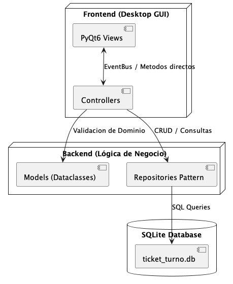
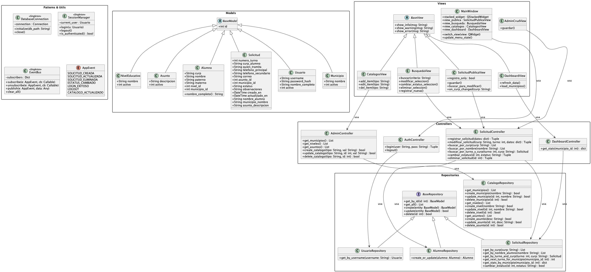

# Ticket de Turno

Sistema de agendamiento de citas escolares para el sector educativo del estado de Coahuila.

## 1. Descripción
Aplicación Desktop (MVC) para gestionar solicitudes de trámites escolares. Los padres de familia registran datos de sus hijos (alumno) usando la CURP como llave primaria, para generar un comprobante (Ticket de Turno) con un número secuencial por municipio. Los administradores del sistema gestionan, consultan y resuelven las solicitudes a través de un panel protegido por login.

## 2. Arquitectura
La aplicación sigue un estricto patrón **MVC (Model-View-Controller)** en capas:
- **Models**: Entidades del dominio (`Alumno`, `Solicitud`, `Usuario`, `Municipio`, `NivelEducativo`, `Asunto`) usando `@dataclass` para cumplir totalmente con OOP.
- **Views**: Interfaces gráficas creadas en PyQt6. Libres de lógica de negocio o acceso directo a base de datos.
- **Controllers**: Coordinadores que reciben señales de las vistas, aplican validaciones de negocio, interactúan con los `Repositories` y usan el `EventBus` para notificar cambios de estado.
- **Repositories**: Capa de abstracción sobre la BD SQLite, implementando el patrón Repository con una interfaz genérica CRUD (`BaseRepository[T]`).



## 3. Patrones de Diseño

### 3.1 Repository Pattern
Separa las consultas SQL de los controladores mediante una interfaz CRUD abstracta genérica:
```python
class BaseRepository(ABC, Generic[T]):
    @abstractmethod
    def get_by_id(self, id) -> Optional[T]: ...
    @abstractmethod
    def get_all(self) -> List[T]: ...
    @abstractmethod
    def create(self, entity: T) -> T: ...
    @abstractmethod
    def update(self, entity: T) -> bool: ...
    @abstractmethod
    def delete(self, id) -> bool: ...
```

### 3.2 Observer Pattern (EventBus)
Desacopla componentes enviando eventos tipados. Por ejemplo, al cambiar un estatus, el Dashboard se actualiza automáticamente sin dependencia directa:
```python
EventBus().publish(AppEvent.ESTATUS_CAMBIADO, {...})
```

### 3.3 Singleton
Garantiza una única instancia de los recursos compartidos (`DatabaseConnection`, `SessionManager`, `EventBus`) durante todo el ciclo de vida de la aplicación, controlando el acceso concurrente con threading locks.

> Para más detalle sobre los patrones, consultar `patrones_de_diseno.html`.

## 4. Modelo de Datos (ER)


## 5. Diagrama de Clases (UML)


## 6. Instalación y Ejecución
1. Verifica Python 3.11+: `python --version`
2. Crear entorno virtual:
   ```bash
   python -m venv venv
   source venv/bin/activate
   # En windows: venv\Scripts\activate
   ```
3. Instalar dependencias:
   ```bash
   pip install -r requirements.txt
   ```
4. Ejecutar app:
   ```bash
   python main.py
   ```
5. Para poblar la base de datos con datos de prueba:
   ```bash
   sqlite3 ticket_turno.db < populate_data.sql
   ```

## 7. Estructura del Proyecto
```
proyecto/
├── main.py                      # Punto de entrada de la aplicación
├── database/
│   ├── connection.py            # Singleton de conexión SQLite
│   └── schema.sql               # DDL de tablas, índices y triggers
├── models/
│   ├── base_model.py            # Clase base abstracta
│   ├── alumno.py                # Entidad Alumno (PK: CURP)
│   ├── solicitud.py             # Entidad Solicitud/Ticket
│   ├── usuario.py               # Entidad Usuario administrador
│   ├── municipio.py             # Catálogo Municipio
│   ├── nivel_educativo.py       # Catálogo Nivel Educativo
│   └── asunto.py                # Catálogo Asunto/Trámite
├── views/
│   ├── main_window.py           # Ventana principal con menú y navegación
│   ├── login_view.py            # Diálogo de autenticación
│   ├── solicitud_publica_view.py# Formulario público de registro/modificación
│   ├── busqueda_view.py         # Panel admin: búsqueda, CRUD y estatus
│   ├── admin_crud_view.py       # Diálogo de edición de solicitud
│   ├── catalogos_view.py        # CRUD de catálogos (Municipios, Niveles, Asuntos)
│   └── dashboard_view.py        # Dashboard con gráficas matplotlib
├── controllers/
│   ├── auth_controller.py       # Lógica de login/logout
│   ├── solicitud_controller.py  # Lógica de negocio de solicitudes
│   ├── admin_controller.py      # Lógica de catálogos
│   └── dashboard_controller.py  # Estadísticas del dashboard
├── repositories/
│   ├── base_repository.py       # Interfaz genérica CRUD abstracta
│   ├── solicitud_repository.py  # Persistencia de solicitudes
│   ├── alumno_repository.py     # Persistencia de alumnos
│   ├── catalogo_repository.py   # Persistencia de catálogos
│   └── usuario_repository.py    # Persistencia de usuarios
├── patterns/
│   └── event_bus.py             # Patrón Observer (EventBus Singleton)
├── utils/
│   ├── curp_validator.py        # Validación de formato CURP
│   ├── session_manager.py       # Singleton de sesión activa
│   └── ticket_generator.py      # Generador de PDF de comprobante
└── assets/
    ├── styles.qss               # Estilos globales de la UI
    └── images/                  # Logo institucional
```

## 8. Decisiones Técnicas
- **SQLite**: No requiere instalación de servidor externo, ideal para una aplicación de escritorio distribuible. Los datos se almacenan en un archivo local.
- **PyQt6**: Binding oficial y moderno de Qt para Python. Soporta estilizado mediante QSS (Qt Style Sheets) y permite una UI nativa multiplataforma.
- **bcrypt**: Hash de contraseñas seguro para la autenticación de administradores.
- **matplotlib**: Generación de gráficos estadísticos (pastel y barras) embebidos directamente en la interfaz Qt.
- **reportlab**: Generación de comprobantes PDF profesionales con logo institucional.
- **Patrones de diseño**: Repository, Observer y Singleton maximizan la escalabilidad, el desacoplamiento y la limpieza del código siguiendo principios SOLID.

## 9. Credenciales de Demo
- **Usuario:** admin
- **Clave:** Admin123!

## 10. Autores
- David Eduardo Lara Flores
- Miguel Arrollo Lopez
