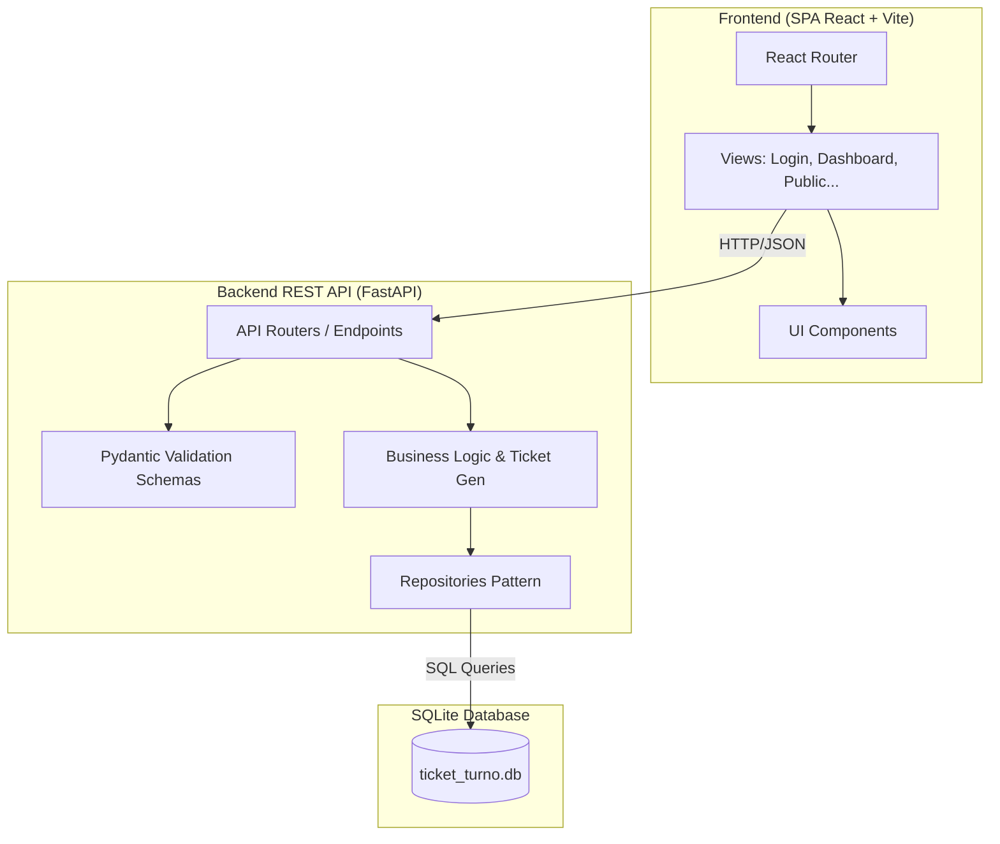
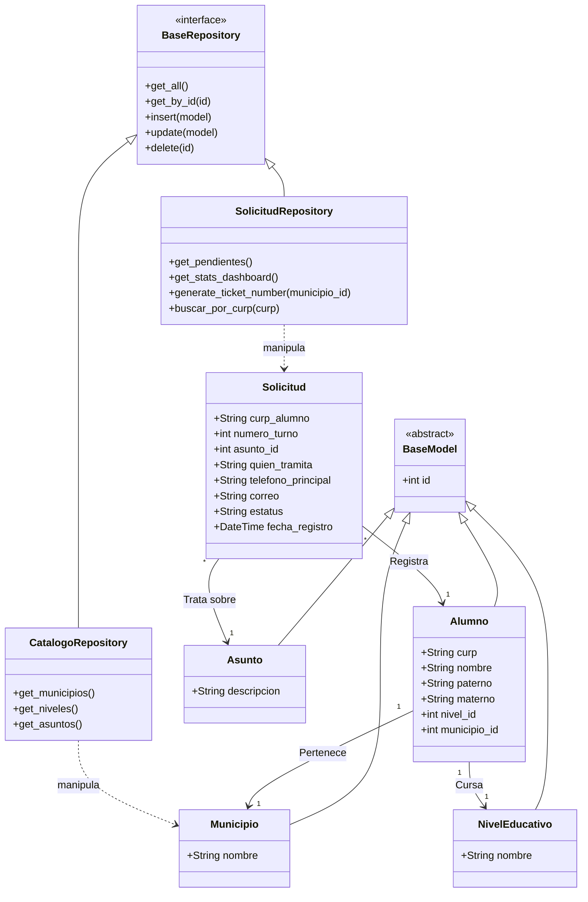

# Arquitectura y Estructura del Sistema (Ticket de Turno)

A continuación te presento los diagramas solicitados generados a **nivel senior** mostrando los patrones de diseño (Repository, REST API, Client-Server MVC) y las interacciones de base de datos.

## 1. Arquitectura del Sistema (Despliegue General)

> [!NOTE]
> Se utiliza el **Patrón Cliente-Servidor**. Toda la responsabilidad de renderizado (MVC) recae en el Frontend React, mientras que el Backend Python se reduce exclusivamente a una API REST transaccional que emite JSON. 

---

## 2. Diagrama de Clases UML (Dominio Backend)

Este diagrama modela la lógica de las entidades de negocio y la separación de responsabilidades usando el **Patrón Repositorio**.

> [!TIP]
> **Desacoplamiento Senior:** Al tener una capa `BaseRepository`, si mañana cambias `SQLite` por `PostgreSQL` o `MySQL`, tu capa de controladores (API) no sufriría ninguna modificación, protegiendo así la escalabilidad de tu app.
